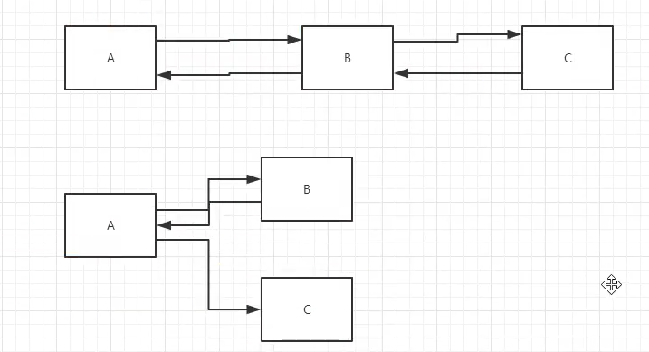

# 基础知识
以后不用但是 代表整个web

### ServletContext--整个webapp应用
1. 共享数据
2. 获取初始化参数
3. 请求转发
4. 读取资源文件
**Properties**
   * 在java目录下新建properties
   * 在resources目录下新建properties

结果: 都被打包同一个路径下:classes,俗称这个路径为:classpath:
思路:需要一个文件流

### 两个参数--Request,Response
web服务器接收客户端的http请求,针对这个请求,创建request对象和response对象

  * 获取客户端请求过来的参数--->HTTPServletRequest
  * 给客户端响应一些信息--->HTTPServletRequest

#### Response响应
### 1.简单分类
**负责向浏览器发送数据的方法**
```java
//一般流
servletoutputStream getoutputStream() throws IOException;
//中文
PrintWriter getWriter() throws IOException;
```
**向浏览器发送响应头的方法**
### 2.常见应用
1. 向浏览器输出消息
2. 下载文件
    1. 现在文件路径
    2. 下载的文件名
    3. 设置浏览器支持下载我们需要的东西
    4. 获取下载文件的输入流
    5. 创建缓冲区
    6. 获取InputStream对象
    7. 将FileOutputStream流写入buffer缓冲区
    8. 使用InputStream将缓冲区的数据输出到客户端
3. 验证码---ImageServlet
4. 实现重定向(重点)
面试题:重定向与转发区别
相同点
  * 页面都会跳转

不同点
* 请求转发,URL不会变坏
* 重定向时候 ,URL地址栏会发生变化


#### Request请求
  HttpServletRequest代表客户端的请求,通过http协议访问服务器,http请求中的所有信息会被封装HTTPServletRequest,通过这个方法可以获取客户端的 **所有信息**

**1. 获取前端传递的参数**